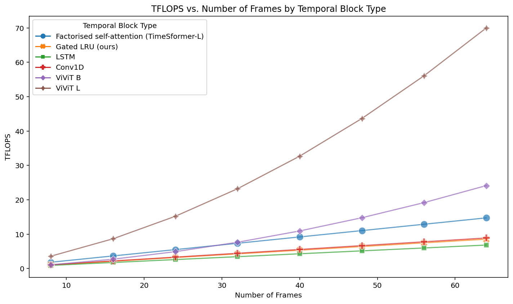

# TRecViT-Submission

**Table 1: Ablations on SSv2 classification**

| Ablation                           | Acc  |
|------------------------------------|------|
| Gated LRU block [0.6, 0.999] (ours) | **66.7** |
| No skip connection (lower lr)    | 15.5 |
| No input gate, no rec gate       | 66.0 |
| No conv layer                    | 64.9 |
| Griffin range [0.9, 0.999]       | 65.8 |
| Eigenvalues (A) ~0.0             | 66.2 |

**Table 2: Performance and training speed of different temporal modules on SSv2**

| Temporal module (w skip)               | Acc  | Steps per sec (training) |
|------------------------------------------|------|--------------------------|
| Factorised self-attention (TimeSformer-L) | 62.4 | 8.3                      |
| LSTM                                     | 63.7 | 6.0                      |
| Conv1D                                   | 40.3 | 10.5                     |
| TRecViT                                  | **66.7**| 8.9                      |

Okay, here is the table converted to Markdown format:

| Ablation                                  | Acc  |
|-------------------------------------------|------|
| Gated LRU block                           | **66.7** |
| No skip connection (lower lr)             | 15.5 |
| No input gate, no rec gate              | 66.0 |
| No conv layer                           | 64.9 |
| Griffin range [0.9, 0.999], all outputs | 65.8 |
| Eigenvalues ~0.0, all outputs           | 66.2 |
| Last output only, eigenvalues [0.7, 0.999] | 65.0 |
| Eigenvalues ~0.0, last output only      | 54.2 |

